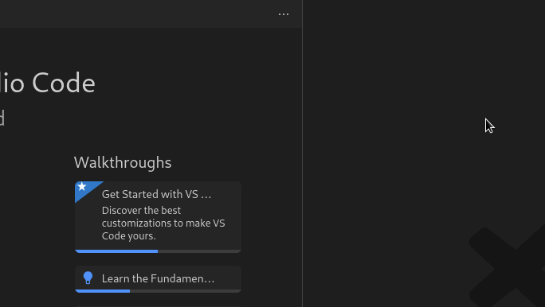

# VSCode DocSearch extension

> An all-in-one [VSCode](http://code.visualstudio.com) extension for searching multiple documentation sources, without leaving your editor.

[](https://github.com/brpaz/vscode-docsearch/actions/workflows/ci.yml)
[](https://app.codecov.io/gh/brpaz/vscode-docsearch)
[](https://marketplace.visualstudio.com/items?itemName=brpaz.docsearch)
[](https://img.shields.io/visual-studio-marketplace/i/brpaz.docsearch?style=for-the-badge)](https://marketplace.visualstudio.com/items?itemName=brpaz.vscode-docsearch)
[](LICENSE)

## Motivation

As a Software Engineer, searching documentation is a part of the daily routine, but finding that documentation site, in the middle of your open tabs or bookmarks is not always easy.

I built this extension, to simplify the process and be able to do it directly from VSCode.

## Demo



## Features

- Search in dozens of documentation sites, whose search is powered by [Algolia Docsearch](https://docsearch.algolia.com/), [Mkdocs](https://www.mkdocs.org/) or available at [DevDocs](https://devdocs.io/). These will probably cover 80% of documentation sites out there.
- Open a search result in your default browser, to see the documnetation in full glory.

### How it works?

This extension uses the public available endpoints of each documentation provider to do the search, so the results should be exactly the same when searching on the documentation sites directly.

There is no scrapping or indexing. It´s simply an HTTP request, to existing search engines.

### Included Documentation

By default, this extension includes the following documnetation:


### Docsearch

* [Apollo GraphQL](https://www.apollographql.com/docs/)
* [Astro](https://astrocloud.io/docs)
* [Babel](https://babeljs.io/docs/en/)
* [Backstage](https://backstage.io/docs)
* [Bootstrap](https://getbootstrap.com/docs/)
* [Cloudflare](https://developers.cloudflare.com/docs)
* [Cypress](https://docs.cypress.io/)
* [Directus](https://docs.directus.io/)
* [Echo](https://echo.labstack.com/guide)
* [ESLint](https://eslint.org/docs/user-guide/)
* [FluxCD](https://fluxcd.io/docs/)
* [Gatsby](https://www.gatsbyjs.org/docs/)
* [GitLab](https://docs.gitlab.com/)
* [Gorm](https://gorm.io/docs/)
* [Grafana](https://grafana.com/docs/)
* [GraphQL](https://graphql.org/learn/)
* [Gridsome](https://gridsome.org/docs/)
* [Helm](https://helm.sh/docs/)
* [Jest](https://jestjs.io/docs/en/)
* [Laravel](https://laravel.com/docs)
* [NextJS](https://nextjs.org/docs/)
* [NestJS](https://docs.nestjs.com/)
* [Netlify](https://docs.netlify.com/)
* [Nuxt](https://nuxtjs.org/guide)
* [Parcel](https://parceljs.org/docs.html)
* [Pinia](https://pinia.vuejs.org/)
* [Prettier](https://prettier.io/docs/en/index.html)
* [Prisma](https://docs.prisma.io/)
* [Prometheus](https://prometheus.io/docs/)
* [React](https://reactjs.org/docs/getting-started.html)
* [Scala](https://docs.scala-lang.org/)
* [Strapi](https://strapi.io/documentation)
* [Supabase](https://docs.supabase.io/)
* [Symfony](https://symfony.com/doc/current/index.html)
* [Tailwind](https://tailwindcss.com/docs)
* [Terraform](https://developer.hashicorp.com/terraform/docs)
* [TRPC](https://trpc.io/docs)
* [Typescript](https://www.typescriptlang.org/docs/)
* [Vercel](https://vercel.com/docs)
* [Vite](https://github.com/vitejs/vite/blob/master/README.md)
* [VitePress](https://vitepress.org/docs/)
* [Vue Router](https://router.vuejs.org/)

#### MkDocs

* [ArgoCD](https://argoproj.github.io/argo-cd/)
* [copier](https://copier.readthedocs.io/en/stable/)
* [Nginx Ingress Controller](https://kubernetes.github.io/ingress-nginx/user-guide/)
#### DevDocs

- [CSS documentation — DevDocs](https://devdocs.io/css/)
- [Git documentation — DevDocs](https://devdocs.io/git/)
- [Go documentation — DevDocs](https://devdocs.io/go)
- [HTML documentation — DevDocs](https://devdocs.io/html/)
- [JavaScript documentation — DevDocs](https://devdocs.io/javascript/)


## Getting started


### Installation

Launch VS Code Quick Open (`Ctrl+P`), paste the following command, and press enter.

```sh
ext install brpaz.vscode-docsearch
```

### Usage

To activate the extension, toggle your command palette and search for `Documentation`.

After that, you will be prompted to select the documentation site your want to search, following by a prompt to input your search query.

### Disable a default documentation site

If you want to disable a default documnetation site, provided by the extension:

1. Open command pallete and select: `Preferences: Open user settings (JSON).
2. create a new json object like the following:

```json
"docsearch.defaultDocsets": {
    "react": false,
  }
```

This example will disable React documnetation. Press `CTRL+Space` insde the object, to get autocomplete for the available documentations.


## Contributing

Contributions are what make the open source community such an amazing place to be learn, inspire, and create. Any contributions you make are **greatly appreciated**.

1. Fork the Project
2. Create your Feature Branch (`git checkout -b feature/AmazingFeature`)
3. Commit your Changes (`git commit -m 'Add some AmazingFeature'`)
4. Push to the Branch (`git push origin feature/AmazingFeature`)
5. Open a Pull Request

## FAQ

### A documentation site stopped working

This can happen, if there is any change in the documentation site, like changing the search provider or URL.

This is more frequent with sites provided by Algolia Docsearch, as it´s common for the website maintanters to change API Keys or other configurations of DocSearch. If you find a broken documnetation, please open an issue.

### This extension includes versioned API keys. Are they secure?

These API keys are required to be able to authenticate on Algolia Docsearch. They are read only and are already public as they are included in the various documnetation site sources, that implements Algolia DocSearch. You can see them in all the requests sent to Algolia. (just check the "Network" tab in your browser console).

## Author

👤 **Bruno Paz**

* Website: [brunopaz.dev](https://brunopaz.dev)
* Github: [@brpaz](https://github.com/brpaz)


## 💛 Support the project

If this project was useful to you in some form, I would be glad to have your support.  It will help to keep the project alive and to have more time to work on Open Source.

The sinplest form of support is to give a ⭐️ to this repo.

You can also contribute with [GitHub Sponsors](https://github.com/sponsors/brpaz).

[](https://github.com/sponsors/brpaz)


Or if you prefer a one time donation to the project, you can simple:

<a href="https://www.buymeacoffee.com/Z1Bu6asGV" target="_blank"></a>


## Credits

This extension doesn´t scrape or index any documentation on their own. It simply uses public available endpoints provided by the different documentation sites.

This project wouldn´t be possible without [Algolia Docsearch](https://docsearch.algolia.com/), [DevDocs](https://devdocs.io), [MkDocs](https://www.mkdocs.org/) and all the websites building their docs portals using these technologies.

## 📝 License

Copyright © 2023 [Bruno Paz](https://github.com/brpaz).

This project is [MIT](https://opensource.org/licenses/MIT) licensed.

<a href="https://www.flaticon.com/free-icons/search" title="search icons">Search icons created by Vectors Market - Flaticon</a>
